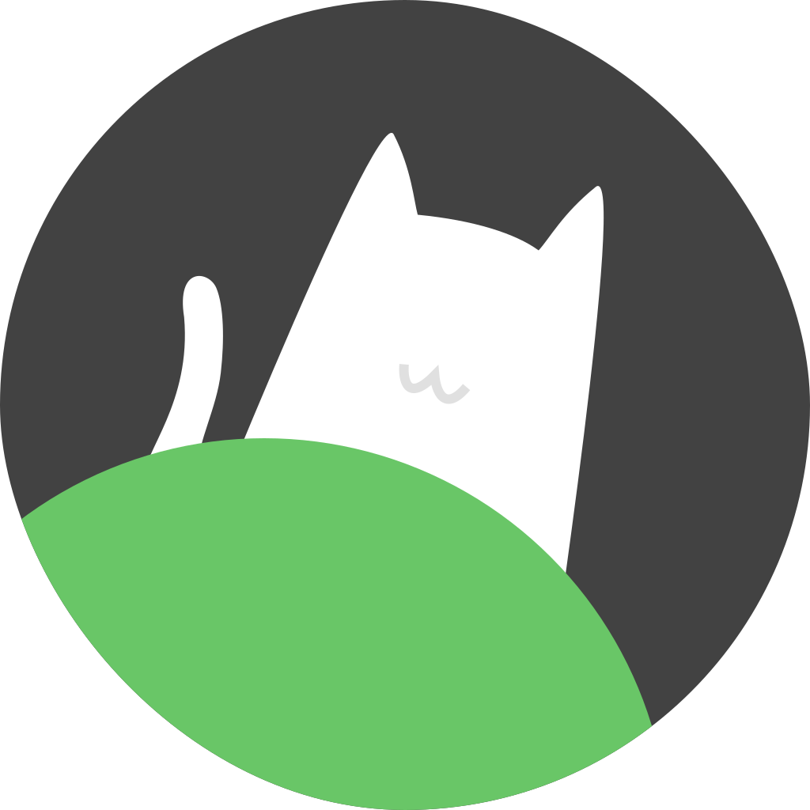
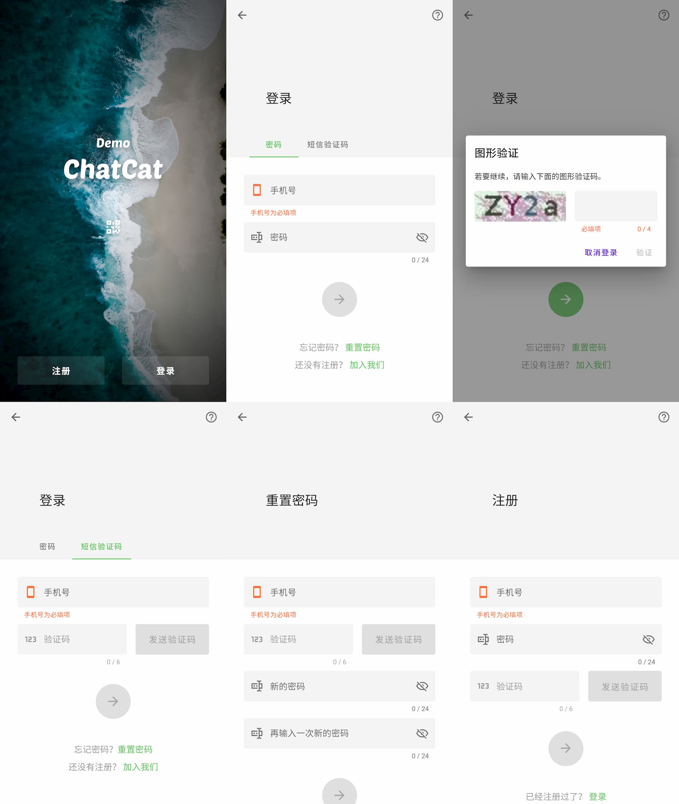
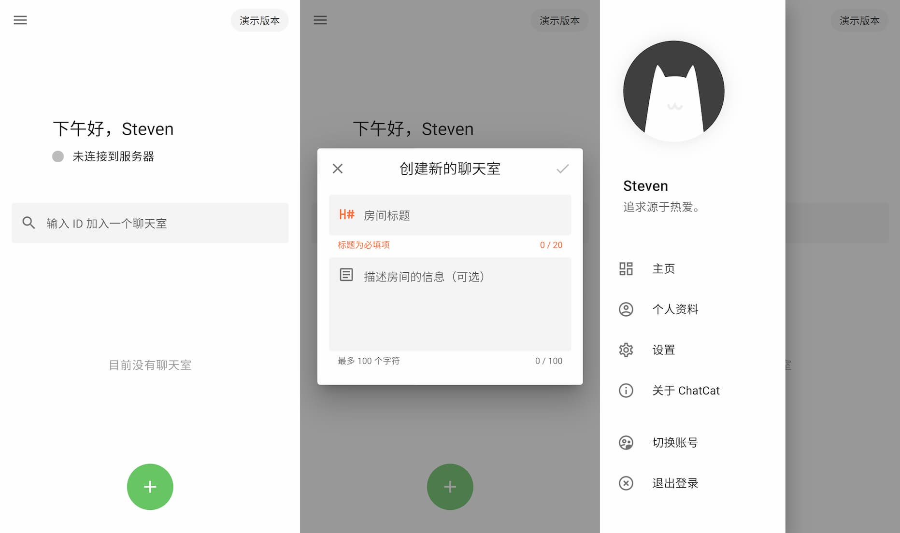
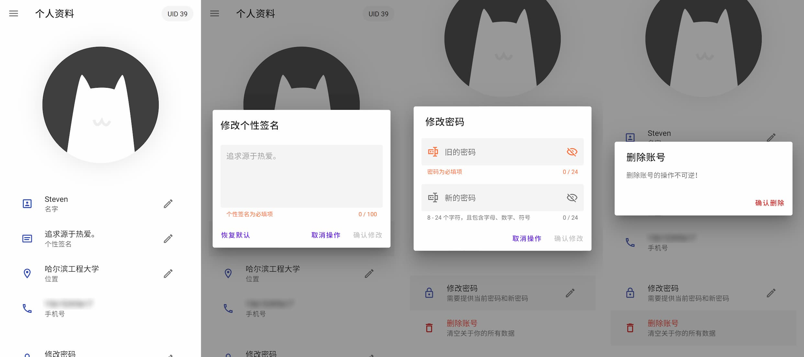
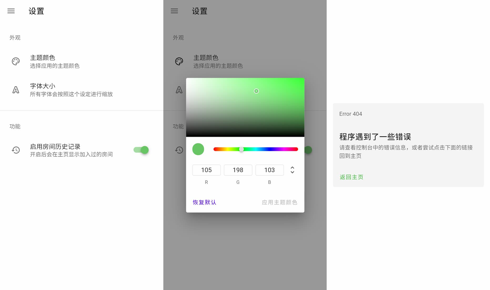

<p align="center">
  
</p>

<h1 align="center">ChatCat Web</h1>
<p align="center">ChatCat 的 Web 端，使用 Nuxt.js 搭建</p>

## 功能

我们的设想是完成一个简单的、基于浏览器的聊天室，具有基本的登录、注册和重置密码的功能。

目前已经实现了用户的登录、注册、重置密码以及个人信息的修改等功能。

## 技术

- 前端框架 Vue2

- 服务端渲染 Nuxt.js
- UI 框架 Vuetify

## 设计

界面和图标设计使用 Figma，部分设计稿：[Figma](https://www.figma.com/file/WohAxhrVUF0bo0mC1YMj3B/ChatCat-Home?node-id=0%3A1) 。

## 截图









## 开发

开发使用 Node.js v12.18.3。

建议使用 Yarn 安装依赖：

```bash
$ yarn
```

运行开发版本：

```bash
$ yarn dev
```

运行生产版本：

```bash
$ yarn build
$ yarn start
```

## 测试

自动化测试在另一个仓库：https://github.com/ChatCat-Team/Web-Test

## 开源协议

MIT License
